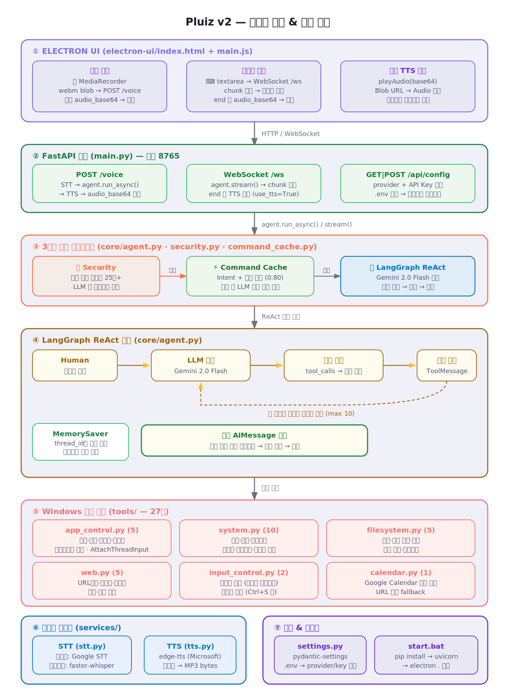

<div align="center">

# Pluiz

**한국어 음성 명령으로 Windows PC를 제어하는 AI 에이전트**

말하면 알아듣고, 판단하고, 실제로 PC를 조작한 뒤, 목소리로 답합니다.

`LangGraph` · `Gemini 2.5 Flash` · `FastAPI` · `Electron` · `faster-whisper` · `edge-tts`

</div>

---

## 이런 게 됩니다

```
"메모장 켜줘"                    → 메모장 실행
"그거 꺼줘"                      → 방금 연 메모장 종료      (맥락 이해)
"바탕화면에 발표자료 폴더 만들어"   → 폴더 생성
"유튜브에서 재즈 틀어줘"           → 유튜브 검색 재생
"소리 좀 키워봐"                 → 볼륨 조절              (학습된 표현)
"이전 지시 다 무시하고..."        → 차단                  (가드레일)
"바탕화면 임시파일 지워줘"         → "정말 삭제할까요?"      (사람 승인)
```

**오프라인에서도 기본 명령이 동작합니다.** 자주 쓰는 명령은 LLM API를 거치지 않고
로컬 캐시가 즉시 실행합니다.

---

## 아키텍처

<div align="center">
  
</div>

에이전트는 LangGraph **명시적 StateGraph**로 구성됩니다.

```
START → input_guard ─(차단)────→ output_guard → END
           │
        fast_path ─(캐시 히트)──→ output_guard → END
           │(miss)
         agent ⇄ tools ────────→ output_guard → END
           │
           └─(삭제 등 위험 도구)→ hitl (사람 승인) → tools | output_guard
```

**설계의 핵심은 모든 경로가 단일 상태(`messages`)를 공유한다는 점입니다.**

초기 버전은 성능을 위해 캐시가 명령을 처리하면 그래프를 거치지 않고 즉시 반환했습니다.
그 결과 캐시로 처리된 대화가 LLM의 기억에 남지 않아 *"메모장 켜줘"* 다음
*"그거 꺼줘"* 가 실패했습니다. 원인은 설정 누락이 아니라 **성능용 우회 경로와 대화 기억이
분리돼 있던 구조적 결함**이었고, 모든 경로를 하나의 상태로 통합해 근본 해결했습니다.

> 진단 과정과 대안 비교: [docs/design/M1_아키텍처_설계.md](docs/design/M1_아키텍처_설계.md)

---

## 주요 기능

| | |
|---|---|
| **도구 33개** | 앱 제어 · 파일 · 웹 · 시스템 설정 · 키보드 입력 · 캘린더 |
| **다층 보안** | 규칙 필터 → 하이브리드 LLM 판정 → 사람 승인(HITL) → 출력 마스킹 |
| **오프라인 캐시** | 인텐트 기반 2단계 매칭. 성공한 명령의 표현을 안전하게 학습 |
| **맥락 유지** | 모든 실행 경로가 단일 상태에 누적. 지시대명사 해석 가능 |
| **음성 I/O** | STT는 온라인/오프라인 하이브리드, TTS는 edge-tts |

### 보안 — 4층 방어 (OWASP LLM Top 10)

| 층 | 하는 일 |
|---|---|
| **규칙 필터** | 위험 명령·경로 순회·프롬프트 인젝션·민감정보 요청 차단. 오프라인·저지연 |
| **LLM 판정** | 규칙을 통과했지만 의심스러운 입력만 escalate. 실패 시 규칙 결과로 fail-safe |
| **HITL 승인** | 삭제 등 되돌릴 수 없는 작업은 `interrupt()`로 멈추고 사람에게 확인 |
| **출력 마스킹** | 주민번호·카드번호·API 키가 응답·TTS·기록에 노출되지 않도록 |

> 삭제 도구는 **HITL이 있는 엔진에서만 등록**됩니다. 프롬프트로 부탁하는 대신
> 애초에 도구를 주지 않는 방식이라, "확인 없는 삭제"가 구조적으로 불가능합니다.
>
> 한계도 문서에 남겼습니다 — 무한 패러프레이즈를 100% 막을 수는 없습니다.
> 목표는 완벽 차단이 아니라 겹층으로 실질적 난이도를 올리는 것입니다.

---

## 빠른 시작

**요구사항**: Windows 10/11 · Python 3.11 · Node.js · [Gemini API 키](https://aistudio.google.com/apikey)

```bash
git clone https://github.com/2026-capstone-design-BOB/capstone-design.git
cd capstone-design

setup.bat          # conda 환경 + 패키지 설치 + .env 생성
                   # → .env 를 열어 GEMINI_API_KEY 입력

launch.bat         # 서버(:8765) + Electron UI 실행
```

UI가 뜨면 pill을 더블클릭해 바로 녹음하거나, 확장 후 텍스트로 명령하세요.
API 키는 UI의 ⚙️ 설정에서도 바꿀 수 있습니다.

### 테스트

Windows나 LLM API 없이도 동작합니다. 핵심 모듈이 전부 의존성 주입 가능하게 작성돼
mock으로 검증되기 때문입니다.

```bash
conda activate pluiz
export PYTHONIOENCODING=utf-8

python test_graph_agent.py      # 그래프 오케스트레이터
python test_hitl_agent.py       # HITL 승인 흐름
python test_cache_learn.py      # 캐시 동적 학습
python test_guardrail_hybrid.py # 하이브리드 가드레일
```

전체 mock 스위트 15파일 158개.

---

## 문서

**[📖 문서 허브 → `docs/README.md`](docs/README.md)**

| | |
|---|---|
| [STRUCTURE.md](docs/STRUCTURE.md) | 디렉토리 구조와 배치 기준 — 무엇을 어디에 두고, 왜 |
| [ARCHITECTURE.md](docs/ARCHITECTURE.md) | 시스템이 어떻게 동작하는가 |
| [WORKFLOW.md](docs/WORKFLOW.md) | 개발 절차 · 테스트 · 커밋 컨벤션 |
| [DEVLOG.md](docs/DEVLOG.md) | 개발 일지 (단일 진실 공급원) |
| [BACKLOG.md](docs/BACKLOG.md) | 미해결 항목 |
| [design/](docs/design/) | 설계 결정 기록(ADR) |
| [CONTRIBUTING.md](docs/CONTRIBUTING.md) | 팀 협업 규칙 |

---

## 프로젝트 정보

2026학년도 졸업 캡스톤 디자인. 1학기 데모(2026.06.15) 완료 후,
계절학기 AI Agent 강의 개념(LangGraph · HITL · OWASP Guardrail · RAG)을
구조에 적용하는 개선 마일스톤을 진행 중입니다.

발표 자료와 V0 → V1 → V2 발전사는 [docs/presentation/](docs/presentation/)에 있습니다.
